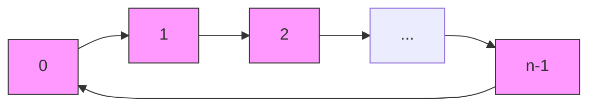

# Disruptor技术详解与实践

## 一、Disruptor简介

Disruptor是由LMAX Exchange开发的一个开源的高性能内存队列组件。它最初被设计用于解决金融交易系统中的延迟问题，后来因其卓越的性能表现被广泛应用于各类高并发场景。作为一个单机版的内存队列解决方案，Disruptor在设计上采用了许多创新性的技术，使其能够在普通硬件上实现每秒处理600万订单的超高性能。

### 1. 核心特性
- **高性能**：采用环形数组和无锁算法，大大减少锁竞争和内存屏障
- **低延迟**：通过内存预分配和防止伪共享等技术，确保微秒级的处理延迟
- **事件驱动**：基于事件驱动模型，支持异步处理和流式处理
- **无依赖**：不依赖于任何外部组件，仅需要JDK环境

### 2. 主要应用场景
  - Log4j2的异步日志实现
  - Canal的数据同步方案
  - Apache Storm的消息处理

### 3. 与传统队列的区别
下面来看下 JDK 中内置的队列和 Disruptor 的对比。队列的底层实现一般分为三种：数组、链表和堆，其中堆一般是为了实现带有优先级特性的队列，暂不考虑。另外，像 ConcurrentLinkedQueue 、LinkedTransferQueue 属于无界队列，在稳定性要求特别高的系统中，为了防止生产者速度过快，导致内存溢出，只能选择有界队列。这样 JDK 中剩下可选的线程安全的队列还有ArrayBlockingQueue 和 LinkedBlockingQueue。
由于 LinkedBlockingQueue 是基于链表实现的，由于链表存储的数据在内存里不连续，对于高速缓存并不友好，而且 LinkedBlockingQueue 是加锁的，性能较差。ArrayBlockingQueue 有同样的问题，它也需要加锁，另外，ArrayBlockingQueue 存在伪共享问题，也会导致性能变差。

不同于传统的BlockingQueue，Disruptor通过以下特点实现了更高的性能：
- 采用环形数组而非链表结构
- 使用CAS无锁算法替代传统锁机制
- 实现了基于事件的生产者-消费者模型
- 支持复杂的消费者依赖关系

## 二、核心概念与架构

Disruptor的整体架构设计基于LMAX架构思想，采用事件源（Event Sourcing）模式，通过事件驱动来实现高性能的并发处理。

### 1. 核心组件

#### RingBuffer（环形缓冲区）
- 环形数组结构，用于存储事件数据
- 数组大小必须是2的幂次方，便于利用位运算进行快速定位
- 通过序号递增的方式，实现数组复用，避免频繁GC
- 预分配所有的事件对象，避免运行时创建对象的开销

#### Sequence（序号管理）
- 递增序号，标识进度信息
- 通过填充避免伪共享问题
- 序号管理包括：
  - 生产者序号（表示生产者的进度）
  - 消费者序号（表示消费者的进度）
  - 可用序号（表示可以消费的序号范围）

#### Sequencer（序号分配器）
- 协调生产者和消费者之间的数据交换
- 两种实现方式：
  - SingleProducerSequencer（单生产者）
  - MultiProducerSequencer（多生产者）
- 负责序号的申请和发布

#### SequenceBarrier（序号屏障）
- 协调消费者与生产者/其他消费者的速度
- 确保消费者不会消费未准备好的数据
- 维护依赖关系的处理顺序
- 处理消费者之间的依赖关系

#### WaitStrategy（等待策略）
- BlockingWaitStrategy：使用锁和条件变量，CPU使用率低
- SleepingWaitStrategy：循环等待，间隔性重试，平衡延迟和CPU使用率
- YieldingWaitStrategy：自旋等待，低延迟但CPU使用率高
- BusySpinWaitStrategy：持续自旋，极低延迟，CPU使用率最高
- TimeoutBlockingWaitStrategy：支持超时的阻塞策略

#### EventProcessor（事件处理器）
- 事件处理的核心单元
- 负责监听RingBuffer，处理事件
- 维护消费者的消费进度

### 2. 架构设计

#### 生产者-消费者模型
- **单生产者-单消费者**：最简单的模式，性能最优
- **多生产者-单消费者**：通过CAS保证线程安全
- **单生产者-多消费者**：支持广播和竞争两种模式
- **多生产者-多消费者**：最复杂的场景，支持多种消费模式

#### 事件驱动模型
- 基于事件源模式
- 支持事件的顺序处理
- 支持事件的并行处理
- 支持事件处理的依赖关系编排

#### 无锁设计架构
- 使用CAS操作代替传统锁
- 序号管理的无锁设计
- 环形缓冲区的无锁访问
- 消除伪共享的内存布局

### 3. 数据流转过程
1. 生产者申请写入位置（获取序号）
2. 生产者写入事件数据
3. 生产者发布事件（发布序号）
4. 消费者等待可消费的序号
5. 消费者处理事件数据
6. 消费者更新消费进度

## 三、性能优化原理

Disruptor能够实现如此高的性能，主要得益于其精心设计的底层机制和多项性能优化技术。本章将详细介绍这些优化原理。

### 1. 核心优化技术

#### 1.1 环形数组结构（RingBuffer）
- **数组优势**
  - 内存分配连续，对CPU缓存友好
  - 相比链表，数组具有更好的内存局部性
  - 通过位运算快速定位，性能更优



#### 1.2 无锁设计（CAS操作）
- **锁的问题**
  - 传统锁会导致线程上下文切换
  - 锁竞争会导致性能下降
  - 死锁风险
- **CAS优势**
  - 避免线程切换开销
  - 减少内存屏障
  - 提高并发性能

#### 1.3 缓存行填充（消除伪共享）

- **伪共享问题**
  - CPU缓存以缓存行为单位
  - 多线程修改同一缓存行的不同变量会导致缓存失效
- **填充解决方案**
  - 使用padding字段填充缓存行
  - 确保热点数据独占缓存行
  - Java 8提供@Contended注解

#### 1.4 内存预分配
- **预分配优势**
  - 避免运行时内存分配
  - 减少GC压力
  - 提高内存访问效率
- **实现方式**
  - 启动时预分配RingBuffer
  - 复用事件对象
  - 避免频繁创建对象

### 2. 性能对比分析

#### 2.1 与ArrayBlockingQueue对比
| 特性 | Disruptor | ArrayBlockingQueue |
|------|-----------|-------------------|
| 锁机制 | 无锁CAS | ReentrantLock |
| 内存分配 | 预分配 | 动态分配 |
| 缓存行优化 | 有 | 无 |
| 队列结构 | 环形数组 | 普通数组 |
| 消费者模式 | 多模式 | 单一模式 |

#### 2.2 性能测试数据
```mermaid
bar
    title 每秒处理消息数量对比（百万次/秒）
    Disruptor单生产者-单消费者 : 6
    Disruptor多生产者-单消费者 : 4.5
    ArrayBlockingQueue : 1.5
    LinkedBlockingQueue : 1
```

### 3. 性能优化策略

#### 3.1 等待策略选择
- **根据场景选择合适的等待策略**
  - 低延迟场景：BusySpinWaitStrategy
  - 低CPU消耗：BlockingWaitStrategy
  - 平衡模式：YieldingWaitStrategy
  - 批处理场景：SleepingWaitStrategy

#### 3.2 批量处理
- **实现方式**
  - 使用BatchEventProcessor
  - 合理设置批处理大小
  - 实现批量事件处理接口

#### 3.3 生产者类型选择
- **单生产者**
  - 性能最优
  - 无需处理并发
  - 适合大多数场景
- **多生产者**
  - 需要CAS保证线程安全
  - 性能略低
  - 适合复杂业务场景

### 4. 注意事项
1. **容量设置**
   - 必须是2的幂次方
   - 根据实际需求设置合理的大小
   - 考虑内存占用

2. **性能调优建议**
   - 避免过度优化
   - 根据实际场景选择策略
   - 注意监控和调试
   - 合理使用批处理

## 四、参考链接
1. [LMAX Disruptor官方文档](https://lmax-exchange.github.io/disruptor/)
2. [得物技术：Disruptor在撮合引擎的实践](https://mp.weixin.qq.com/s/kmuG5azJnqjKRYlkiVHWqQ)
3. [Disruptor源码](https://github.com/LMAX-Exchange/disruptor)
4. [Martin Fowler对Disruptor的介绍](https://martinfowler.com/articles/lmax.html)
5. [Disruptor原理及实践](https://mp.weixin.qq.com/s/frXIBZzKkflTpm7fWuigSg)
6. [高性能内存队列Disruptor](https://mp.weixin.qq.com/s/YKZ1n5O30nowOrfmjMcmOw)
